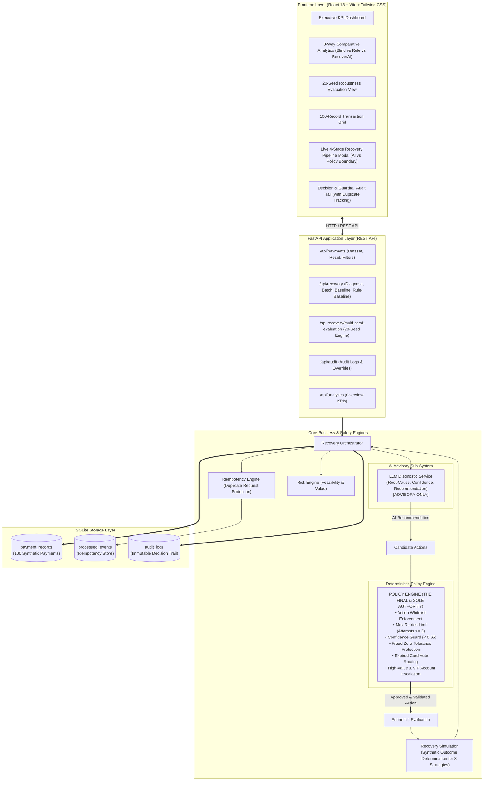

# RecoverAI System Architecture & Safety Design

> **Razorpay AI Buildathon 2026 — Track 03: AI Revenue Recovery Agent**

---

## 1. End-to-End System Architecture



---

## 2. Zero-Trust Authority Flow

The controlling pipeline is:

**Payment Event → Idempotency → AI Diagnosis → Candidate Actions → Deterministic Policy Engine → Economic Evaluation → Recovery Simulation → Audit Trail**

> **AI RECOMMENDS. POLICY ENGINE DECIDES. ECONOMICS WEIGHS.**

```
LLM Diagnostic Service              Deterministic Policy Engine               Outcome / Execution
   (ADVISORY ONLY)                     (FINAL AUTHORITY)                       (SIMULATION ONLY)

┌───────────────────────┐            ┌───────────────────────┐            ┌───────────────────────┐
│ • Root-Cause Analysis │            │ • Whitelist Validation│            │ • Simulated Recovery  │
│ • Confidence Score    │ ─────────> │ • Safety Guardrails   │ ─────────> │ • Revenue Calculation │
│ • Recommended Action  │            │ • Explicit Overrides  │            │ • Immutable Audit Log │
└───────────────────────┘            └───────────────────────┘            └───────────────────────┘
  *Zero financial state                *Sole authorization                   *Synthetic outcomes
   modification power*                  decision maker*                       only*
```

> [!IMPORTANT]
> **Safety Rule**: The LLM is strictly an advisory diagnostic agent. It has **zero permission** to execute transactions or alter ledger state directly. Every recommendation must be approved or overridden by the deterministic Policy Engine before execution.

---

## 3. Policy Engine Guardrail Matrix

| Scenario | Trigger Condition | Policy Approved Action | Guardrail Rule & Audit Reason |
|---|---|---|---|
| **Idempotency Guard** | Duplicate `event_id` submission | `DUPLICATE_BLOCKED` | `RULE_IDEMPOTENCY_DUPLICATE_BLOCK`: Prevents duplicate executions. |
| **Unauthorized Action** | LLM outputs non-whitelisted string | `ESCALATE` | `RULE_UNAUTHORIZED_ACTION_BLOCK`: Blocks unauthorized proposals. |
| **Suspected Fraud** | `error_code == 'SUSPECTED_FRAUD'` | `NO_ACTION` | `RULE_FRAUD_ZERO_TOLERANCE`: Prohibits retries/reminders on fraud. |
| **Expired Instrument** | `error_code == 'CARD_EXPIRED'` | `ALTERNATE_PAYMENT` | `RULE_CARD_EXPIRED_NO_RETRY`: Retrying expired card guaranteed to fail. |
| **Max Retries Exceeded** | `retry_count >= 3` | `ALTERNATE_PAYMENT` / `ESCALATE` | `RULE_MAX_RETRIES_LIMIT_ENFORCED`: Prevents customer fatigue. |
| **Low Confidence** | `confidence < 0.65` | `ESCALATE` | `RULE_CONFIDENCE_THRESHOLD_OVERRIDE`: Routes to human verification. |
| **High-Value / VIP** | Amount $\ge$ ₹50,000 or VIP account | `ESCALATE` | `RULE_HIGH_VALUE_VIP_ESCALATION`: Priority desk handoff. |

---

## 4. 3-Way Comparative Evaluation Framework

All figures below come from controlled synthetic simulations using documented probability assumptions. This evaluation does **not** claim real-world statistical significance or live gateway performance.

To evaluate the value of AI, RecoverAI implements a 3-way evaluation framework:

1. **Baseline 1: Naive Blind Retry**:
   - Strategy: Blind immediate 3x retries on all failures without root-cause diagnosis.
    - Evaluation: Seed-42 batch net recovered ₹998,501.09, with 27.61% revenue recovery and 24.0% transaction recovery.
2. **Baseline 2: Simple Rule-Based Recovery**:
   - Strategy: Static deterministic mapping of error codes to recovery channels.
    - Evaluation: Seed-42 batch net recovered ₹2,038,402.48, with 56.09% revenue recovery and 65.0% transaction recovery.
3. **RecoverAI (AI Contextual Diagnosis + Deterministic Policy Engine)**:
   - Strategy: LLM contextual root-cause reasoning combined with strict deterministic policy guardrails.
    - Evaluation: Seed-42 batch net recovered ₹2,671,622.71, with 73.54% revenue recovery and 84.0% transaction recovery.

### Seed 42 Results

| Metric | RecoverAI | Simple Rule | Blind Retry |
|---|---:|---:|---:|
| Gross recovered | ₹2,674,177.71 | ₹2,039,557.48 | ₹1,003,861.09 |
| Intervention cost | ₹2,555.00 | ₹1,155.00 | ₹5,360.00 |
| Net recovered | ₹2,671,622.71 | ₹2,038,402.48 | ₹998,501.09 |
| Revenue recovery | 73.54% | 56.09% | 27.61% |
| Transaction recovery | 84/100 = 84.0% | 65.0% | 24.0% |

RecoverAI recorded 32 retries, 0 wasted/failed retries, 15 policy overrides, and 5 fraud blocks with 100% blocked.

### 20-Seed Robustness Evaluation

The robustness run covers 2,000 synthetic transactions. RecoverAI results were mean gross ₹2,552,810.19, mean intervention cost ₹2,110.50, mean net ₹2,550,699.69, mean revenue recovery 68.62%, and mean transaction recovery 82.15%. The recovery range was 74.0%–89.0%, with a median of 82.0% and standard deviation of ±4.22%.

Mean net was ₹1,847,238.48 for Simple Rule and ₹699,693.11 for Blind Retry. RecoverAI's net uplift was +₹703,461.20 (+38.08%) versus Rule and +₹1,851,006.58 (+264.55%) versus Blind. Transaction advantage was +19.10 percentage points versus Rule and +61.40 percentage points versus Blind.

---

## 5. Directory Structure

```
recoverai/
├── backend/
│   ├── app/
│   │   ├── config.py              # Configuration & LLM provider detection
│   │   ├── database.py            # SQLite session management
│   │   ├── models.py              # PaymentRecord, ProcessedEvent, & AuditLog models
│   │   ├── schemas.py             # Pydantic schemas, 3-way metrics, & multi-seed schemas
│   │   ├── generator.py           # Synthetic data generator (seed=42 for main demo)
│   │   ├── main.py                # FastAPI entrypoint, CORS, startup lifecycle
│   │   ├── services/
│   │   │   ├── risk_engine.py     # Revenue at risk & feasibility assessment
│   │   │   ├── llm_service.py     # LLM diagnostic service + deterministic fallback
│   │   │   ├── policy_engine.py   # FINAL AUTHORITY deterministic guardrails
│   │   │   ├── simulator.py       # 3-way strategy simulation engine
│   │   │   └── orchestrator.py    # Pipeline coordinator & multi-seed evaluation
│   │   └── routers/
│   │       ├── payments.py        # /api/payments endpoints (with idempotency reset)
│   │       ├── recovery.py        # /api/recovery endpoints (diagnose, batch, baselines)
│   │       ├── audit.py           # /api/audit endpoints (with duplicate tracking)
│   │       └── analytics.py       # /api/analytics endpoints
│   ├── scripts/
│   │   └── evaluate_seeds.py      # 20-seed robustness evaluation CLI script
│   ├── tests/
│   │   └── test_core.py           # 15 automated unit & integration tests
│   ├── .env.example
│   └── requirements.txt
├── frontend/
│   ├── src/
│   │   ├── components/
│   │   │   ├── Header.jsx         # Status badge, 3 baseline trigger buttons
│   │   │   ├── KpiCards.jsx       # 5 financial KPI cards & simulation disclaimer
│   │   │   ├── ComparisonView.jsx # 3-way strategy comparison & 20-seed robustness drawer
│   │   │   ├── TransactionTable.jsx # 100-record grid with search/filters
│   │   │   ├── RecoveryModal.jsx  # Live 4-stage pipeline modal (AI vs Policy boundary)
│   │   │   ├── AuditTrail.jsx     # Filterable override & duplicate audit log
│   │   │   └── ArchitectureView.jsx # In-app architecture & safety inspector
│   │   ├── App.jsx                # Main application container
│   │   ├── main.jsx
│   │   └── index.css
│   ├── package.json
│   ├── tailwind.config.js
│   └── vite.config.js
├── .env.example                   # Root environment template
├── .gitignore                     # Git ignore rules
├── README.md                      # Comprehensive project overview & demo guide
└── ARCHITECTURE.md                # System architecture & safety design document
```
